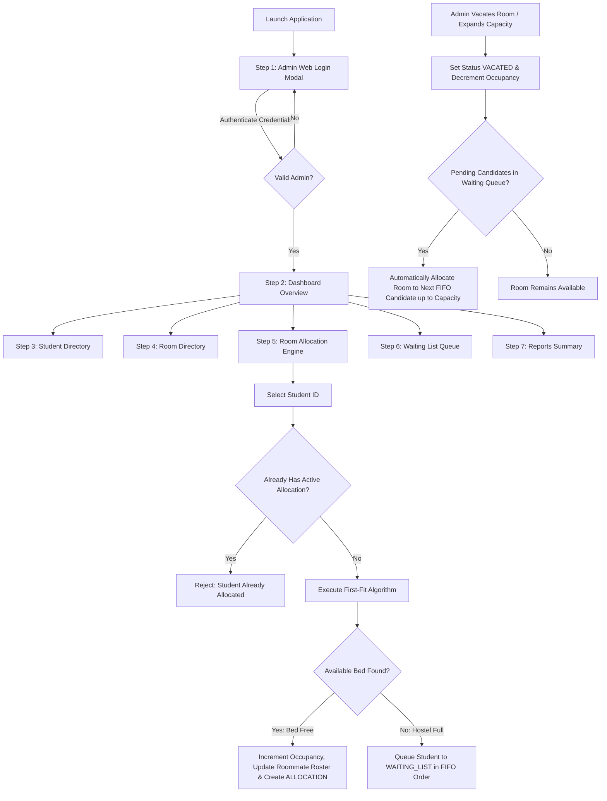

# 🏢 Hostel Room Allocation Management System (HRAMS)

> A modern, full-stack Web Application for hostel administrators to automate student enrollment, room directory management, **First-Fit room allocation with multi-bed roommate co-occupancy rosters**, **FIFO waiting list queue management**, room vacating, and audit reports.

---

## 📌 1. What is HRAMS?

The **Hostel Room Allocation Management System (HRAMS)** is a digital web platform built to eliminate paper-based hostel tracking and spreadsheets. It gives hostel administrators a single, real-time dashboard to manage occupancy, automate room assignments, enforce capacity limits, and maintain an auditable waiting list.

### Key Features:
- 🔐 **Secure Administrator Web Login**: Asynchronous authentication (`admin` / `admin123`) with a centered square card login interface.
- 📊 **Real-Time KPI Dashboard**: Instant visual statistics for Total Students, Available Rooms with Free Beds, Full Rooms, and FIFO Waiting Candidates.
- 🎓 **Student Directory Management**: Full CRUD operations (Add, View, Update, Delete) and live search filter by Student ID or Name.
- 🏢 **Room Directory & Capacity Controls**: Manage rooms (`room_number`, `capacity`, `occupied_count`, `room_type`, `floor`) with live status badges (`Available`, `Partially Occupied`, `Full`) and active allocation deletion protection.
- ⚡ **Automated First-Fit Allocation Engine**: $\mathcal{O}(n)$ greedy First-Fit algorithm assigning students to available room beds. Enforces a single active allocation limit per student.
- 👥 **Multi-Student Roommate Sharing Roster**: Clear display of room bed occupancy ratios (e.g. `A-102 (2/2 Beds)`) and the complete roster of co-occupant roommates sharing each room.
- ⏳ **FIFO Waiting List Queue**: Automatically queues unallocated students when hostel capacity is full in strict First-In-First-Out order.
- 🚪 **Vacate & Automated Queue Fulfillment**: Vacating a room decrements occupancy and automatically allocates freed beds to pending waiting queue candidates.
- 📈 **Audit Reports Export**: Formatted summary reports for Active Allocations, Room Capacity Breakdown, and FIFO Waiting Candidates.

---

## 🛠️ 2. Technology Stack

| Layer | Technologies Used |
|---|---|
| **Backend Framework** | **Spring Boot 3.2.3** (`spring-boot-starter-web`) running embedded Tomcat server |
| **Language** | **Java 17+ / JDK 24** |
| **Web Frontend** | **HTML5**, Custom **Glassmorphic Dark CSS3** (`web_styles.css`), Vanilla **JavaScript REST API Client** (`app.js`) |
| **Database & JDBC** | **MySQL 8.x** / **Embedded H2 Database** (`2.2.224`) with `MODE=MySQL` & `AUTO_SERVER=TRUE` (Failover < 1s) |
| **Algorithms** | **First-Fit Greedy Search** $\mathcal{O}(n)$, **FIFO Priority Queue** by `request_date` |
| **Build & Tooling** | **Apache Maven 3.9.6**, **Spring Boot Maven Plugin** |
| **Testing** | **JUnit 5 (Jupiter 5.10.1)**, **Spring Boot Test Integration** (`WebPortalIntegrationTest`) |

---

## 🏗️ 3. System Architecture

HRAMS follows a clean, decoupled **Layered Architecture** with single-direction data flow:

```
+-----------------------------------------------------------------------------------+
|                           Web Browser Client (Frontend)                           |
|             HTML5 Single-Page Application, Glassmorphic CSS3, JS REST Client      |
+-----------------------------------------------------------------------------------+
                                          │
                                          ▼  HTTP / REST API (JSON)
+-----------------------------------------------------------------------------------+
|                        Spring Boot Web REST Controllers                           |
|     AuthController, DashboardApiController, StudentApiController,                 |
|     RoomApiController, AllocationApiController, WaitingListApiController          |
+-----------------------------------------------------------------------------------+
                                          │
                                          ▼
+-----------------------------------------------------------------------------------+
|                                 Service Layer                                     |
|             AllocationService.java  (Business Logic & Queue Fulfillment)        |
+-----------------------------------------------------------------------------------+
                        │                                  │
                        ▼                                  ▼
+-----------------------------------------------+  +--------------------------------+
|               Algorithm Layer                 |  |       Data Access Layer        |
|           AllocationAlgorithm.java            |  | StudentDAO, RoomDAO, AdminDAO, |
|           (First-Fit Room Search)             |  | AllocationDAO, WaitingListDAO  |
+-----------------------------------------------+  +--------------------------------+
                                                                   │
                                                                   ▼
                                                   +--------------------------------+
                                                   |         Database Layer         |
                                                   |     MySQL / Embedded H2 DB     |
                                                   +--------------------------------+
```

---

## 🔄 4. Application Business Workflow



---

## 💻 5. How to Use the Application

### 1. Login
- Open your browser at `http://localhost:8080`.
- Enter administrator credentials (**Username**: `admin` | **Password**: `admin123`).

### 2. Dashboard Overview
- View live metric cards: **Total Students**, **Available Rooms**, **Full Rooms**, and **Waiting Queue**.
- Inspect the active allocations table displaying room numbers, occupancy bed ratios (e.g. `A-102 (2/2 Beds)`), and assigned roommate rosters.

### 3. Manage Students
- Click **Student Directory** from the sidebar.
- Search for students by ID or Name using the search bar.
- Fill out the form to enroll new students (`student_id`, `name`, `email`, `phone`, `course`, `year`, `gender`).

### 4. Manage Rooms
- Click **Room Directory** from the sidebar.
- Add or update rooms (`room_number`, `floor`, `capacity`, `room_type`).
- Rooms automatically update status badges: 🟢 `Available`, 🟡 `Partially Occupied`, or 🔴 `Full`.

### 5. Allocate Rooms (First-Fit Engine)
- Click **Room Allocation** from the sidebar.
- Enter a Student ID (e.g., `STU1001`) and click **"🚀 Trigger First-Fit Allocation"**.
- The system assigns the student to the first available room bed. If all rooms are full, the student is automatically added to the FIFO waiting list queue.

### 6. Manage Waiting Queue & Vacate Rooms
- Click **Waiting List** to view pending candidates in FIFO order (#1, #2, #3...).
- When an active room is vacated, the system **automatically allocates freed beds to pending waiting queue candidates**.

### 7. Export Audit Reports
- Click **Reports & Summary** to generate plain-text ASCII reports for active allocations, room capacity breakdowns, and waiting queue entries.

---

## 🚀 6. Download & Run on Your System

### Prerequisites:
- **Java JDK 17 or higher** (`java -version`)
- **Apache Maven 3.9+** (Bundled portable Maven included)

### Step 1: Clone or Download Project
```bash
git clone https://github.com/your-repo/hostel-room-allocation-system.git
cd "Hostel Room Allocation System"
```

### Step 2: Run Spring Boot Web Server

**On Windows (PowerShell/CMD)**:
```powershell
.\apache-maven-3.9.6\bin\mvn.cmd spring-boot:run
```

**On Linux / macOS**:
```bash
mvn spring-boot:run
```

### Step 3: Open in Web Browser
Open your browser and navigate to:
👉 **[http://localhost:8080](http://localhost:8080)**

#### Default Admin Credentials:
- **Username**: `admin`
- **Password**: `admin123`

---

## 🗄️ Database Setup & Failover

HRAMS features **Dual-Mode Database Failover**:

1. **Embedded H2 Mode (Zero Configuration)**:
   - Starts automatically out-of-the-box.
   - Database directory: `./data/hrams_db.mv.db`
   - No external database server installation required.

2. **MySQL Database Mode**:
   - If a MySQL server is running on `localhost:3306`, HRAMS connects to database `hrams_db`.
   - Initial table DDL and sample seeds are loaded from [`schema.sql`](file:///c:/Users/Dell/Downloads/Hostel%20Room%20Allocation%20System/schema.sql).

---

## 🧪 Running Automated Tests

To execute the unit and integration test suite:

```powershell
.\apache-maven-3.9.6\bin\mvn.cmd clean test
```

All **13 automated tests** pass with **`BUILD SUCCESS`**:
- `AllocationAlgorithmTest` (First-Fit Search)
- `AllocationServiceTest` (Business Logic & Boundaries)
- `FullSystemVerificationTest` (End-to-End Requirements FR-1 through FR-8)
- `WebPortalIntegrationTest` (Spring Boot Web REST API & Tomcat Endpoints)

---

## 📄 License & Credits
Developed for Hostel Room Allocation Management System (HRAMS).
